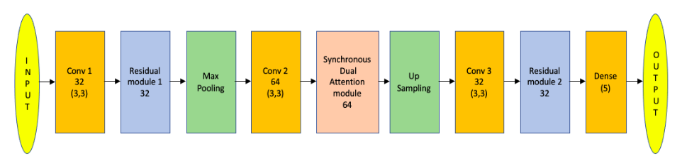
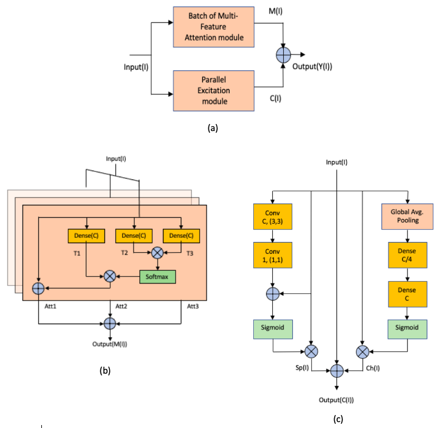
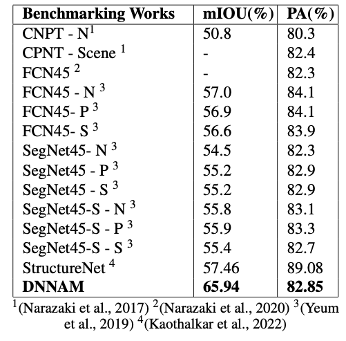
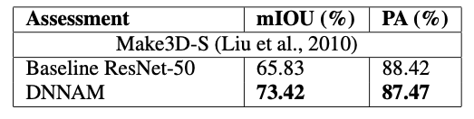

# Deep Neural Network Based Attention Model for Structural Component Recognition

This is the tensorflow implementation of "Deep Neural Network Based Attention Model for Structural Component Recognition". This repository includes the proposed Synchronous Dual Attention Module, Batch of Multi-feature Attention Module and Parallel Excitation Module. The results folder contains the results and the visualizations using attention maps.

# Citation

If you are fully or partially using codes/results from this repository, please cite the following paper:

Sarangi, S. and Mandal, B. (2023). Deep Neural Network Based Attention Model for Structural Component Recognition. In Proceedings of the 18th International Joint Conference on Computer Vision, Imaging and Computer Graphics Theory and Applications - Volume 4: VISAPP, ISBN 978-989-758-634-7; ISSN 2184-4321, pages 317-326. DOI: 10.5220/0011688400003417.

The original paper can be accessed from here: 
https://www.scitepress.org/PublicationsDetail.aspx?ID=z9Gur9jZz0k=&t=1

# The DNNAM architecture

In this work, we propose a novel deep neural network-based attention model (DNNAM) architecture, which comprises synchronous dual attention modules (SDAM) and residual modules to recognise structural components. These modules help us to extract local discriminative features from structural compo- nent images and classify different categories of bridge components. These innovative modules are constructed at the contextual level of information encoding across spatial and channel dimensions. Experimental results and ablation studies on benchmarking bridge components and semantic augmented datasets show that our pro- posed architecture outperforms current state-of-the-art methodologies for structural component recognition.

Diagram of the DNNAM architecture:

Proposed DNNAM Architecture model for structural component recognition. Here Conv block represents convolu- tional operation with the first number representing the number of filters and the next two numbers giving the filter dimension for each channel. Dense represents the dense layer, where the first number gives the number of nodes. The proposed syn- chronous dual attention module is composed of a batch of multi-feature attention module and a parallel excitation module. The number denoted in the synchronous dual attention module and residual module represents filter size.

Diagram of the SDAM (attention module):

The figure describes: (a). Proposed Synchronous dual attention module for DNNAM architecture is composed of a batch of multi-feature attention module and a parallel excitation module. (b). The Batch of multi-feature attention module is a combination of 3 self-attention layers. In each layer, the Input(I), together with its matching height, width, and chan- nel count, are taken into consideration. The attention mask is then created using the SoftMax function, the outputs T2 and T3 are multiplied elementally, and T1 is multiplied with the attention mask to highlight the important features. After that, the identity mapping is completed by adding an input tensor to the output. (c). The Parallel Excitation Module examines the im- portant Spatial, Sp(I) and Channel, Ch(I) Information Sepa- rately. The first half of the module uses convolution blocks to capture the common spatial features present in all chan- nels. The second half of the module includes a function that squeezes the input tensor’s spatial plane using global average pooling before stimulating it channel-wise to get channel information.

# Hyper-parameters for training

The setting for the learning rate, α is 0.001. In order to improve the DNNAM model, the Adam optimizer is used for optimization strategy with β1 = 0.9 and β2 = 0.999. The models are trained using the Bridge component classification dataset over 100 epochs. The experiments are carried out on a system with an Intel(R) Core(TM) i7-9700 processor, 32 GB of RAM, and an NVIDIA GeForce RTX-2080 8GB GPU card utilising the Python Keras API and TensorFlow backend.

# Results

Classification results on Bridge component classification dataset:

Classification results on  Semantic Augmented Make3D dataset:

